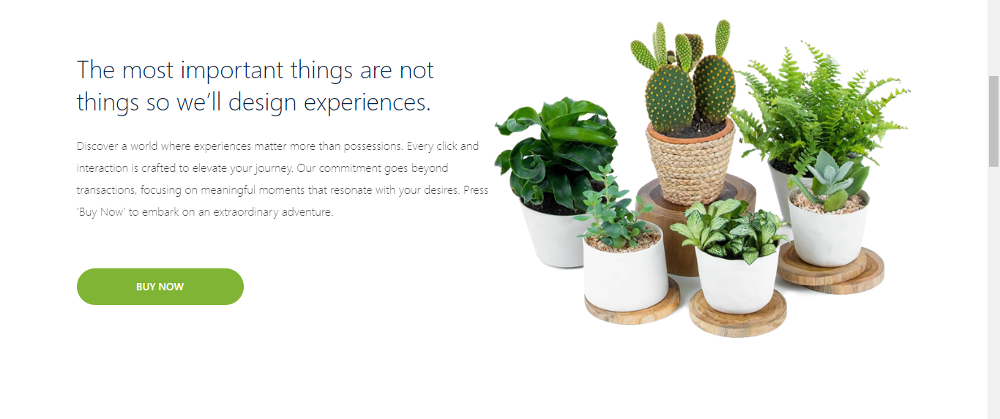
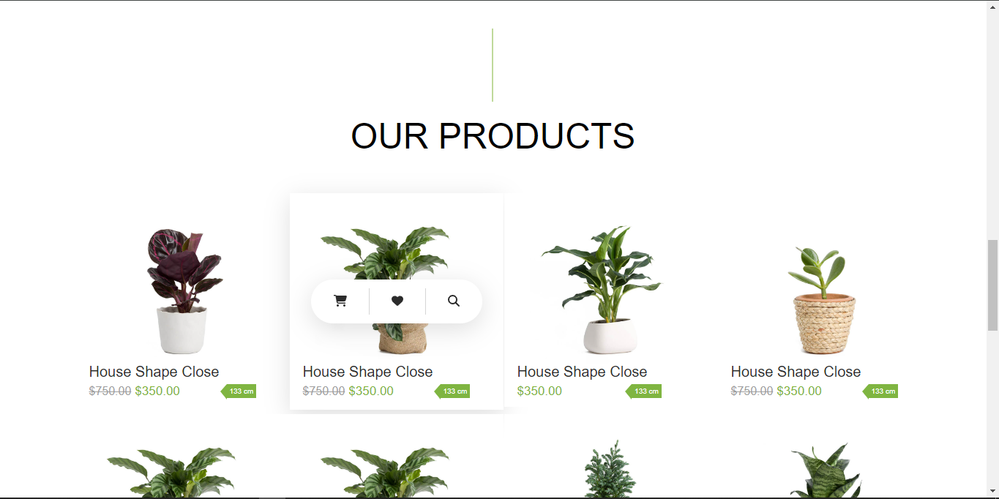

  Welcome to <strong>Plant Paradise</strong>, a delightful front-end application crafted with React, Vite, CSS, and TypeScript. Immerse yourself in the beauty of nature as you explore this online marketplace for buying and selling plants.

## Getting Started

<!-- Remaining content remains unchanged -->

## Technologies Used

- [React](https://reactjs.org/)
- [Vite](https://vitejs.dev/)
- [TypeScript](https://www.typescriptlang.org/)
- [Emotion](https://emotion.sh/)
- [FontAwesome](https://fontawesome.com/)
- [Mantine UI Library](https://mantine.dev/)
- [Dayjs](https://day.js.org/)
- [React Router DOM](https://reactrouter.com/)
- [Tiptap](https://tiptap.dev/)
- [Tabler Icons](https://tablericons.com/)
- CSS

## Dependencies

Check the `package.json` file for a complete list of dependencies and devDependencies.

## Screenshots

  
   
  <em>Hero Section</em>

  
   
  <em>Hero Section Carousel</em>

  
   
  <em>About Section</em>

  
   
  <em>Banner Section</em>

  
  
   
  <em>Product Section</em>

  
   
  <em>Newsletter Section</em>

  
   
  <em>Auth Page</em>

  
   
  <em>404 Error Page</em>

## License

This project is licensed under the MIT License.

Happy gardening! 🌿🌼
