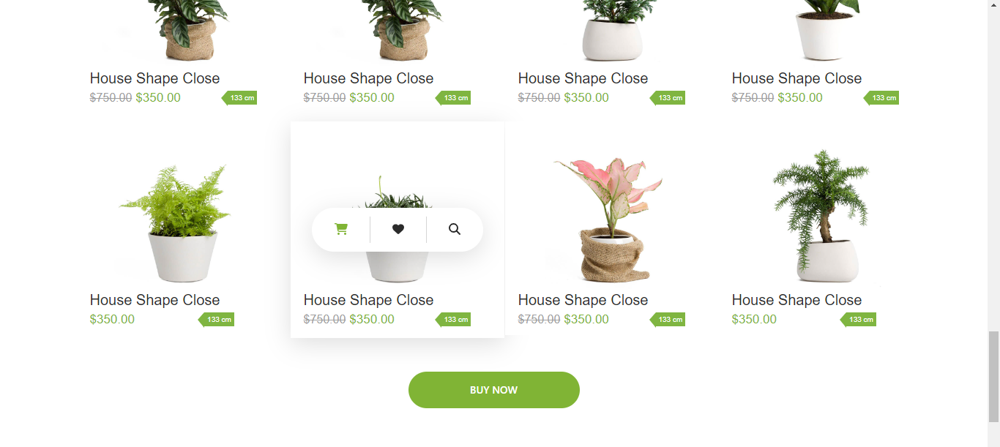

# Plant Paradise

Welcome to **Plant Paradise**, a delightful front-end application crafted with React, Vite, CSS, and TypeScript. Immerse yourself in the beauty of nature as you explore this online marketplace for buying and selling plants.

## Getting Started

To run Plant Paradise locally, follow these simple steps:

1. **Clone the repository:**
    ```bash
    git clone https://github.com/soul-xettri/plant-paradise.git
    ```

2. **Navigate to the project directory:**
    ```bash
    cd plant-paradise
    ```

3. **Install dependencies:**
    ```bash
    yarn install
    ```

4. **Run the development server:**
    ```bash
    yarn dev
    ```

5. **Open your browser and visit [http://localhost:5173](http://localhost:5173) to explore Plant Paradise.**

## Available Scripts

- **`yarn dev`**: Start the development server.
- **`yarn build`**: Build the production-ready application.
- **`yarn lint`**: Lint the TypeScript code using ESLint.
- **`yarn preview`**: Preview the production build locally.

## Technologies Used

- React
- Vite
- TypeScript
- Emotion
- FontAwesome
- Mantine UI Library
- Dayjs
- React Router DOM
- Tiptap
- Tabler Icons

## Dependencies

Check the `package.json` file for a complete list of dependencies and devDependencies.

## Screenshots


*Hero Section*


*Hero Section Carousel*


*About Section*


*Banner Section*



*Product Section*


*Newsletter Section*


*Auth Page*


*404 Error Page*

## License

This project is licensed under the MIT License.

Happy gardening! 🌿🌼
